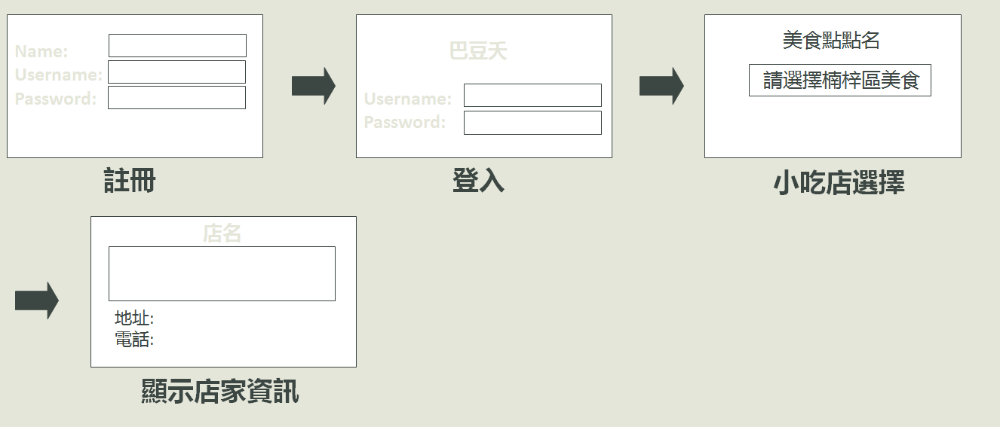
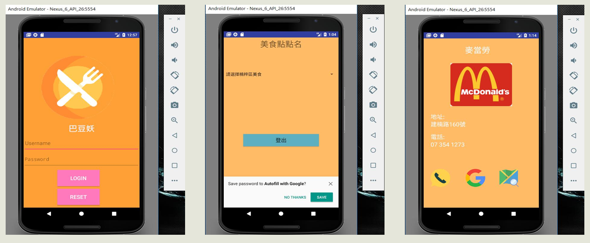

# 專題名稱：道地小吃APP
# ----------------------------------
# 專題組員：林境威
#                 蔡雨戎
#                 楊元達
#                 鄭任宏
# ----------------------------------
# 專案介紹：此App的目的在於讓使用者能更加方便的查詢到各個地區的小吃店，包括地址,聯絡電話,網路評價等等…，可以讓使用者省去許多繁雜的查詢也能快速地知道哪裡是比較熱門或是評價較好的店家。

# ----------------------------------
# 流程圖

# ----------------------------------
# 操作介面

